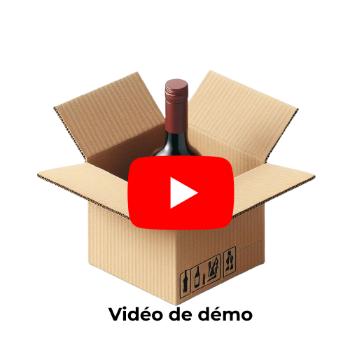

# PolyWine

lien de la vidéo de démo :

## TODO
> #### Vladou
> - **[FINI]** mise en place projet flutter
> - **[FINI]** choix plugins bluetooth
> - **[FINI]** connection bluethoot flutter <> casier vin
> - **[FINI]** frontend app flutter

> #### Gaston
> - **[FINI]** Dockerisation mysql & python Flask
> - **[FINI]** requête HTTP Flutter <> Flask
> - **[FINI]** frontend app flutter

> #### USE CASES
> 1. Se connecter à une cave à vin 
>     - 1.1 Supprimer une cave à vin	
>     - 1.2 Renommer une cave à vin 
>     - 1.3 Activer le bluetooth (s’il n’est pas activé) ✅
> 2. Ajouter une bouteille 
>     - 2.2 saisir manuellement une bouteille (accessible à partir du scan) ✅
>     - 2.3 renommer une bouteille ✅
>     - 2.4 modifier les infos après scan
>     - 2.5 notifications lorsque la bouteille est dans la cave ✅
>     - 2.6 la cave envoie l’emplacement ou la bouteille a été insérée ✅
> 3. Consulter l’état de la cave 
>     - 3.1 Cliquer sur une bouteille (LED clignote, si connecter à la cave) ✅
>     - 3.2 Etat de la cave ✅
>     - 3.3 Visuel de l’état de la cave ✅
> 4. Sélectionner une boouteille
>     - 4.1 fiche technique de la bouteille ✅
>     - 4.2 modifier les infos de la bouteilles ✅

## Cahier des charges 
> - 🔨 : en cours
> - ✅ : fini 

> #### BESOINS :
> 1. Base de données 
>	    - 1.1 stockage des cave ✅
>	    - 1.2 stockage des bouteilles ✅
>	    - 1.3 stockage des bouteilles bues 
> 2. Flutter
>    - 2.1 Visualisation de la cave ✅
>    - 2.2 Identification Visuelle
>    - 2.3 Stockage des bouteilles ajoutées/bues sur le téléphones (si pas internet) ✅

## BACK

>#### endpoints :
>>-  **[POST]** `api/login`
>>      - *send* **json**: `{username, password}`
>>      - *receive* **json**: `{[id_cave, nom_cave]}`
>
>>- **[POST]** `api/signin`
>>     - *send* **json**: `{username, password}`
>
>>- **[POST]** `api/login/cave`
>>     - *send* **json**: `{id_cave}`
>
>>- **[GET]** `api/cave/id`
>>     - Listes des bouteilles
>>     - Nom de la cave (Propriétaire)
>
>>- **[GET]** `api/cave/bouteille/id` 
>>     - Plus d'information sur la bouteille
>>     - *send* **json**: `{id_bouteille}`
>
>>- **[POST]** `api/cave/bouteille`
>>     - ajout / modification d'une bouteille
>>     - *send* **json**: `{nom, region, cuvee, type, annee, url_image}`
>
>>- **[DELETE]** `api/cave/bouteille/id`
>>     - supression d'une bouteille
>>     - *send* **json**: `{id_bouteille}` 
>
>>- **[GET]** `api/cave/historique`
>>     - *send* **json**: `{id_cave}` 
